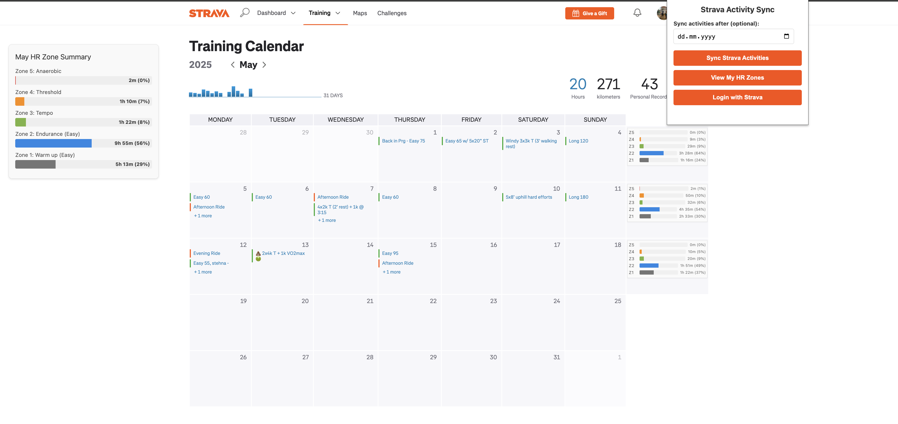
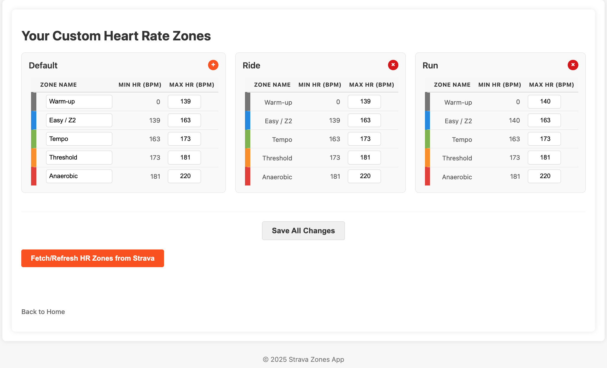

# Strava HR Zone Calendar Visualization

<div align="center">

  <!-- Badges -->
  <a href="https://github.com/stancld/strava-zones/actions/workflows/backend-release-build.yml">
    
  </a>
  <a href="https://codecov.io/github/stancld/strava-zones">
    
  </a>
  
  <a href="LICENSE">
    
  </a>

</div>

> [!NOTE]
> **Disclaimer:** This application is a personal project and is **not affiliated with, endorsed by, or in any way officially connected with Strava, Inc.** All Strava trademarks and logos are the property of Strava, Inc.

> [!NOTE]
> **Vibe-Coded Project:** This project is developed with a "vibe-coding" approach, focusing on learning, exploration, and rapid iteration. Some aspects may reflect this experimental nature rather than production-optimized design.

## Overview

Strava HR Zone Calendar Visualization enhances your Strava experience by integrating detailed Heart Rate (HR) zone data directly into your Training Calendar. This tool, comprising a Chrome Extension and a Django backend, fetches your activity data via the Strava API, processes HR information, and visualizes your time spent in different HR zones on a weekly and monthly basis.

## 🌟 Key Features

*   **Strava Integration:** Secure OAuth2 authentication to access your Strava data.
*   **HR Zone Visualization:** Displays aggregated time-in-zone directly on the Strava Training Calendar page.
*   **Custom HR Zones:** Define your own HR zone boundaries or use Strava's defaults.
*   **Data Synchronization:** Fetches recent activities and processes HR data streams.
*   **Backend API:** Robust Django backend serving data to the Chrome extension.

## 📸 Screenshots

<p align="center">
  
  
</p>

## 🛠️ Technology Stack

*   **Backend:** Python, Django, Django REST Framework, Gunicorn
*   **Frontend (Extension):** JavaScript, HTML, CSS
*   **Database:** PostgreSQL
*   **Containerization:** Docker
*   **CI/CD:** GitHub Actions
*   **External API:** Strava API (v3)

## 🚀 Getting Started

This project uses Docker for easier setup and consistent environments.

### Prerequisites

*   [Docker](https://www.docker.com/get-started) and [Docker Compose](https://docs.docker.com/compose/install/)
*   A Strava API application (create one at [Strava Developers](https://developers.strava.com/)).
*   Git

### Installation & Setup

1.  **Clone the Repository:**
    ```bash
    git clone https://github.com/stancld/strava-zones.git
    cd strava-zones
    ```

2.  **Configure Backend Environment:**
    *   Navigate to the `backend` directory: `cd backend`
    *   Create a `.env` file by copying the example: `cp .env.example .env`
    *   Edit `.env` and fill in your Strava API credentials (`STRAVA_CLIENT_ID`, `STRAVA_CLIENT_SECRET`), database settings (defaults are usually fine for Docker), and a `SECRET_KEY` for Django. Ensure `STRAVA_REDIRECT_URI` matches your Strava API application settings (e.g., `http://localhost:8000/api/auth/strava/callback/` for local development).
    *   Return to the project root: `cd ..`

3.  **Build and Run with Docker Compose:**
    *   From the project root directory (`strava-zones/`):
        ```bash
        docker-compose up --build -d
        ```
    *   This command will build the Docker images for the backend and database, and start the services in detached mode.
    *   To view logs: `docker-compose logs -f strava-backend`

4.  **Load the Chrome Extension:**
    *   Open Chrome and navigate to `chrome://extensions`.
    *   Enable "Developer mode" (usually a toggle in the top right).
    *   Click "Load unpacked".
    *   Select the `frontend/extension` directory from this project.
    *   Ensure the extension ID in `chrome://extensions` matches the `CHROME_EXTENSION_ID` in your backend's `.env` file if you've set `CSRF_TRUSTED_ORIGINS` to use it.

6.  **Access the Application:**
    *   The backend API should now be available at `http://localhost:8000`.
    *   Navigate to your Strava Training Calendar. The extension should activate and attempt to fetch data.
    *   You may need to authenticate via the extension popup or by visiting an API endpoint like `/api/profile/` which will redirect to Strava login.

## ⚙️ API Endpoints Overview

*   **Authentication:**
    *   `GET /api/auth/strava/`: Initiates Strava OAuth2 flow.
    *   `GET /api/auth/strava/callback/`: Handles OAuth2 callback.
    *   `GET /api/profile/`: User profile (requires auth).
*   **Data Sync:**
    *   `POST /api/strava/sync-activities/`: Triggers activity sync (requires auth).
*   **HR Zones:**
    *   `GET, POST /api/settings/custom-zones/`: List or create custom HR zones.
    *   `GET, PUT, DELETE /api/settings/custom-zones/<uuid:pk>/`: Manage specific HR zone config.
    *   `POST /api/fetch-strava-hr-zones/`: Fetch and store HR zones from Strava.
    *   `GET /api/user/hr-zones/`: HTML page for HR zone management.
    *   `GET /api/user/hr-zone-status/`: Status of user's HR zone config.
*   **Aggregated Data for Extension:**
    *   `GET /api/zones/`: Provides aggregated zone data (e.g., time in zones per week/month).

## 📜 License

This project is licensed under the MIT License - see the [LICENSE.md](LICENSE.md) file for details.
