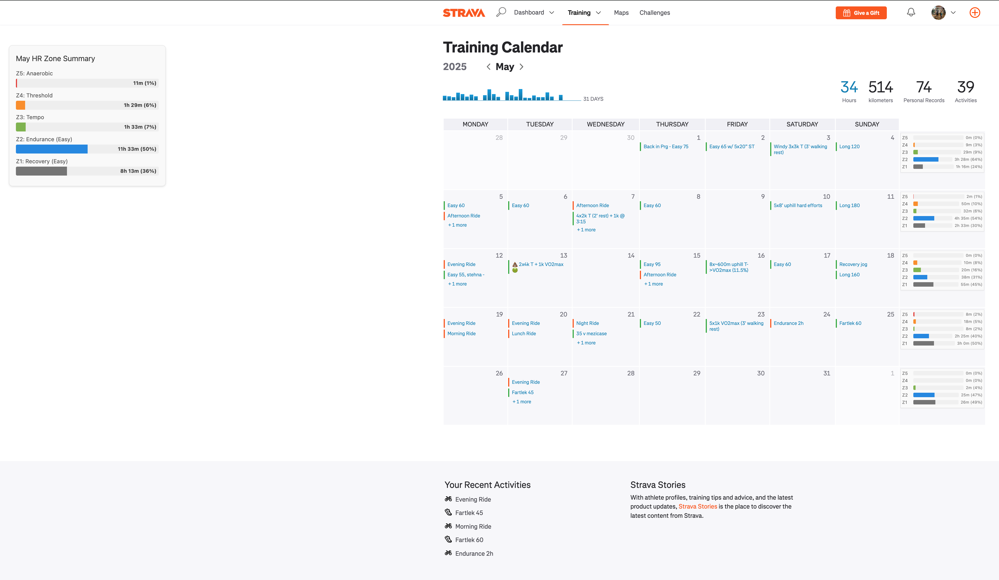
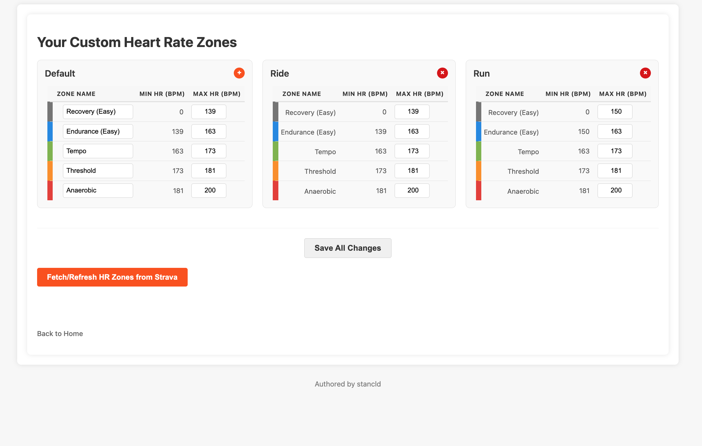

# ZoneLens - Enhanced Training Calendar

<div align="center">
  <a href="https://strava-zones.com" target="_blank">
    
  </a>
  <br/>
  <br/>
  <p>
    <!-- Badges -->
  <a href="https://github.com/stancld/strava-zones/actions/workflows/backend-release-build.yml">
    
  </a>
  <a href="https://codecov.io/github/stancld/strava-zones">
    
  </a>
  
  
  <a href="LICENSE">
    
  </a>
  </p>

</div>

**ZoneLens** enhances your Strava experience by visualizing your Heart Rate (HR) zone data directly on your Training Calendar. Understand your training intensity at a glance and optimize your efforts!

Visit our website: [strava-zones.com](https://strava-zones.com)

> [!IMPORTANT]
> **Chrome Web Store Status:** Our extension is currently **pending review** for publication on the Chrome Web Store. We'll update this space as soon as it's live! In the meantime, you can install it manually (see instructions below for developers, which can be adapted for users).

> [!NOTE]
> **Disclaimer:** This application is a personal project and is **not affiliated with, endorsed by, or in any way officially connected with Strava, Inc.** All Strava trademarks and logos are the property of Strava, Inc.

## ✨ Overview

ZoneLens is a tool designed for athletes who want deeper insights into their training. It consists of a **Chrome Extension** that modifies your Strava Training Calendar page and a **Django backend** that securely processes your activity data via the Strava API.

By fetching your activities and their detailed heart rate streams, ZoneLens calculates the time you've spent in each heart rate zone and displays this information clearly on your calendar, helping you track your training load and recovery effectively.

## 🌟 Key Features

*   **Strava Integration:** Secure OAuth2 authentication to access your Strava data.
*   **HR Zone Visualization:** Displays aggregated time-in-zone directly on the Strava Training Calendar page.
*   **Custom HR Zones:** Define your own HR zone boundaries or use Strava's defaults.
*   **Data Synchronization:** Fetches recent activities and processes HR data streams automatically.
*   **User-Friendly Interface:** Easy-to-understand visuals integrated into your existing Strava workflow.
*   **Secure Backend API:** Robust Django backend serving data to the Chrome extension, ensuring your data is handled safely.

## 📸 Screenshots

<p align="center">
  
  
</p>

## 🧑‍💻 For Users: Getting Started with ZoneLens

Once the extension is available on the Chrome Web Store:

1.  **Install the Extension:** Search for "ZoneLens" on the Chrome Web Store and click "Add to Chrome".
2.  **Connect to Strava:** Open the extension (usually from your browser's toolbar) and follow the prompts to authorize it with your Strava account.
3.  **View Your Zones:** Navigate to your Strava Training Calendar. The extension will automatically enhance the calendar with your heart rate zone data!

*(Manual installation instructions are currently part of the developer setup below. Users comfortable with these steps can also follow them.)*

## 🛠️ Technology Stack

*   **Backend:** Python, Django, Django REST Framework, Gunicorn
*   **Extension:** JavaScript, HTML, CSS
*   **Database:** PostgreSQL
*   **Containerization:** Docker, Docker Compose
*   **CI/CD:** GitHub Actions
*   **External API:** Strava API (v3)

## 🚀 For Developers: Getting Started

This project uses Docker for easier setup and consistent development environments.

### Prerequisites

*   [Docker](https://www.docker.com/get-started) and [Docker Compose](https://docs.docker.com/compose/install/)
*   A Strava API application (create one at [Strava Developers](https://developers.strava.com/)).
*   Git

### Installation & Setup

1.  **Clone the Repository:**
    ```bash
    git clone https://github.com/stancld/strava-zones.git
    cd strava-zones
    ```

2.  **Configure Backend Environment:**
    *   Navigate to the `backend` directory: `cd backend`
    *   Create a `.env` file by copying the example: `cp .env.example .env`
    *   Edit `.env` and fill in your Strava API credentials (`STRAVA_CLIENT_ID`, `STRAVA_CLIENT_SECRET`), database settings (defaults are usually fine for Docker), and a `SECRET_KEY` for Django. Ensure `STRAVA_REDIRECT_URI` matches your Strava API application settings (e.g., `http://localhost:8000/api/auth/strava/callback/` for local development).
    *   Return to the project root: `cd ..`

3.  **Build and Run with Docker Compose:**
    *   From the project root directory (`strava-zones/`):
        ```bash
        docker-compose up --build -d
        ```
    *   This command will build the Docker images for the backend and database, and start the services in detached mode.
    *   To view logs: `docker-compose logs -f strava-backend` (or `docker compose logs -f strava-backend` for newer Docker Compose versions).

4.  **Load the Chrome Extension (Manual Installation):**
    *   Open Chrome and navigate to `chrome://extensions`.
    *   Enable "Developer mode" (usually a toggle in the top right).
    *   Click "Load unpacked".
    *   Select the `extension` directory from this project.
    *   Ensure the extension ID in `chrome://extensions` matches the `CHROME_EXTENSION_ID` in your backend's `.env` file if you've set `CSRF_TRUSTED_ORIGINS` to use it for stricter security during development.

5.  **Access the Application:**
    *   The backend API should now be available at `http://localhost:8000`.
    *   Navigate to your Strava Training Calendar. The extension should activate and attempt to fetch data.
    *   You may need to authenticate via the extension popup or by visiting an API endpoint like `/api/profile/` which will redirect to Strava login if you're not already authenticated.

## ⚙️ API Endpoints Overview

*   **Authentication:**
    *   `GET /api/auth/strava/`: Initiates Strava OAuth2 flow.
    *   `GET /api/auth/strava/callback/`: Handles OAuth2 callback.
    *   `GET /api/profile/`: User profile (requires auth).
*   **Data Sync:**
    *   `POST /api/strava/sync-activities/`: Triggers activity sync (requires auth).
*   **HR Zones Configuration:**
    *   `GET, POST /api/settings/custom-zones/`: List or create custom HR zones.
    *   `GET, PUT, DELETE /api/settings/custom-zones/<uuid:pk>/`: Manage specific HR zone config.
    *   `POST /api/fetch-strava-hr-zones/`: Fetch and store HR zones from Strava.
    *   `GET /api/user/hr-zones/`: HTML page for HR zone management.
    *   `GET /api/user/hr-zone-status/`: Status of user's HR zone config.
*   **Aggregated Data for Extension:**
    *   `GET /api/zones/`: Provides aggregated zone data (e.g., time in zones per week/month for the calendar).

## 📜 License

This project is licensed under the MIT License - see the [LICENSE](LICENSE) file for details.
