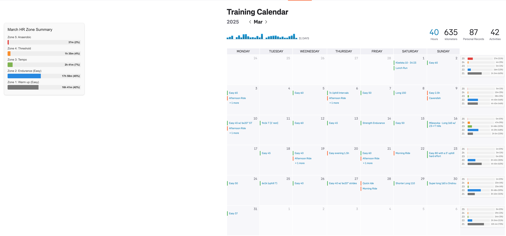

# Strava HR Zone Calendar Visualization

______________________________________________________________________

## ✨ Project Goal

This project enhances the Strava web experience by displaying aggregated Heart Rate (HR) zone data directly on the user's Training Calendar. It involves a Chrome Extension that communicates with a Django backend to fetch, process, and visualize activity data from the Strava API.

The main aim is to provide a visual representation of time spent in different HR zones on a weekly and monthly basis.

## 🧪 Experimental & Learning Focus

This is an **experimental project** primarily developed as an exercise in **"vibe-coding"** – rapidly iterating and building features with a focus on learning and exploration rather than achieving maximum efficiency or a production-ready state. As such, some design choices or implementation details might reflect this learning process.

## 📸 Current State (as of May 9, 2025)

## Core Features

*   **Strava Authentication:** Secure OAuth2 flow managed by the backend.
*   **Custom HR Zones:** (Planned) Users will be able to define their own HR zone boundaries.
*   **Data Processing:** Fetches HR streams, aggregates time-in-zone against custom definitions (monthly & weekly).
*   **Calendar Visualization:** Injects HR zone summaries into the Strava calendar page.

## 🛠️ Technology Stack

*   **Frontend:** Chrome Extension (JavaScript, HTML, CSS)
*   **Backend:** Python, Django, Django REST Framework
*   **Database:** PostgreSQL
*   **External:** Strava API (v3)

## ⚙️ Basic Architecture

A client-server model:
1.  **Chrome Extension:** Runs in the browser, detects calendar view, calls the backend for data, and renders visualizations on the Strava page.
2.  **Django Backend:** Handles Strava authentication, fetches and processes activity/HR data from the Strava API, stores aggregated summaries, and serves data to the extension via a REST API.

## 🚀 Quick Setup Guide

1.  **Backend (Django):**
    *   Set up Python & PostgreSQL.
    *   Install dependencies from `requirements.txt` (if available, or see `PLAN.md` for a list).
    *   Configure `.env` with Strava API credentials and database settings.
    *   Run database migrations.
    *   Start the Django development server.
2.  **Chrome Extension:**
    *   Navigate to `chrome://extensions`.
    *   Enable "Developer mode".
    *   Click "Load unpacked" and select the extension's frontend directory.

## Key API Endpoints

*   `/api/auth/strava`: Initiates Strava OAuth.
*   `/api/auth/strava/callback`: Handles Strava's OAuth callback.
*   `/api/zones?year=YYYY&month=MM`: Provides aggregated zone data to the extension.
*   `/api/zones/settings`: (Planned) For managing user-defined HR zones.

(For more detailed setup and historical planning, see `PLAN.md`.)
